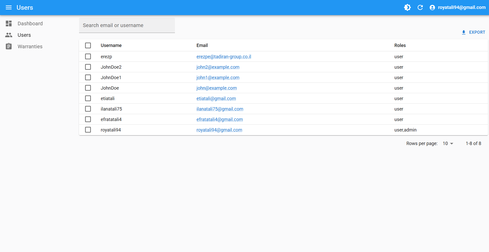
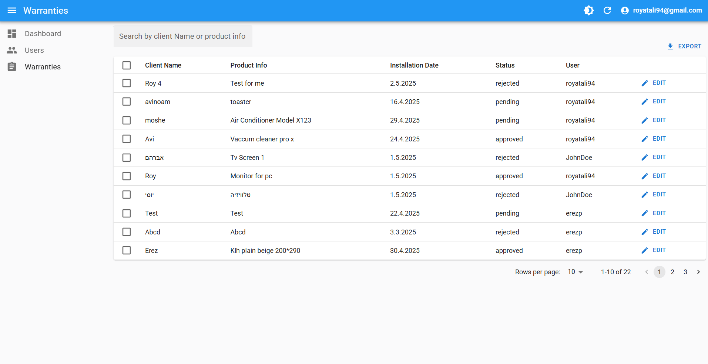
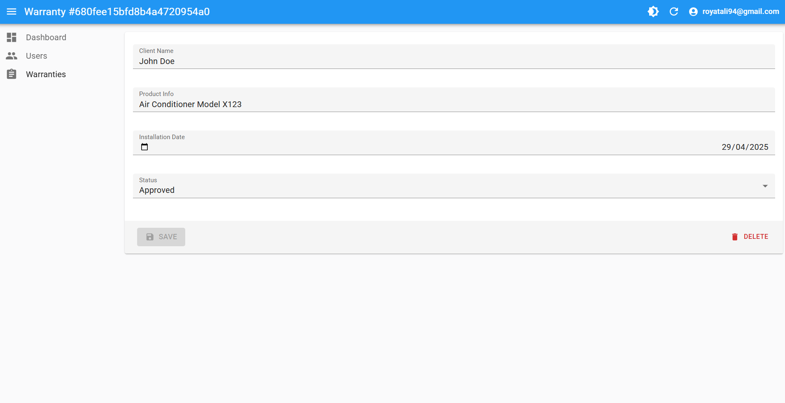

# Fullstack Warranty Management System

A fullstack system for managing warranties, users, and warranties registrations — built with:

- **NestJS (Backend API)**
- **React-Admin (Admin Dashboard)**
- **React Native + Expo (Mobile App)**

---

## Table of Contents

1. [System Overview](#system-overview)
2. [Key Features](#key-features)
3. [Deployment Links](#deployment-links)
4. [Admin Login Credentials](#admin-login-credentials)
5. [Local Setup Instructions](#local-setup-instructions)
   - [1. Clone the Repository](#1-clone-the-repository)
   - [2. Environment Variables](#2-environment-variables)
   - [3. Install Dependencies](#3-install-dependencies)
   - [4. Run the Applications](#4-run-the-applications)
6. [Project Structure](#project-structure)
7. [System Architecture](#system-architecture)
8. [Technologies Used](#technologies-used)
9. [Screenshots](#screenshots)
   - [Swagger Docs](#swagger-docs)
   - [Mobile App](#mobile-app)
   - [React-Admin](#react-admin)
10. [Video Demonstrations](#video-demonstrations)

## System Overview

This project provides a complete warranty management platform, including:

- **Admin Dashboard**: Manage users, and warranties via a React-Admin interface.
- **Mobile App**: Installers can:
  1. signup the app.
  2. login into the app.
  3. register/submit warranties by fill in customer details and uploading invoice.
- **Backend API**: Secure RESTful services with authentication, authorization, and data management.

### Key features

- JWT Authentication & Role-based Authorization (RBAC)
- Admin CRUD Operations
- Mobile warranty registration
- MongoDB with Mongoose ORM
- Swagger API documentation
- Error handling and validation
- Light/Dark mode support

---

## Deployment Links

Admin Panel and Swagger API Docs can take a while to load because they are host on render free tier which slows down the connection if we don't enter it regulary every 15 minutes.

| Component            | URL                                                                                                                        |
| :------------------- | :------------------------------------------------------------------------------------------------------------------------- |
| **Admin Panel**      | [https://tadiran-assignment-react-admin.onrender.com/#/login](https://tadiran-assignment-react-admin.onrender.com/#/login) |
| **Swagger API Docs** | [https://tadiran-assignment.onrender.com/api/swagger/docs](https://tadiran-assignment.onrender.com/api/swagger/docs)       |
| **Mobile App**       | [Expo Project Link](https://expo.dev/accounts/royatali94/projects/frontend/builds/65d467b5-45ab-4c48-898c-da4e4ef46497)    |

---

## Admin Login Credentials

| Field        | Value                  |
| :----------- | :--------------------- |
| **Email**    | `royatali94@gmail.com` |
| **Password** | `Aa123456@`            |

---

## Local Setup Instructions

### Prerequisites

- Node.js (v18+)
- npm or yarn
- Mongoose database
- Expo CLI installed globally

### 1. Clone the Repository

```bash
git clone https://github.com/roy845/Fullstack-Warranty-Management-System.git
```

## 2. Environment Variables

Create `.env` files in each project:

### `/backend/.env`

```env
PORT=
MONGO_INITDB_ROOT_USERNAME=
MONGO_INITDB_ROOT_PASSWORD=
MONGO_DB_NAME=
MONGO_PORT=
MONGO_HOST=
MONGO_URI=
JWT_SECRET=
JWT_EXPIRES_IN=
JWT_REFRESH_TOKEN_SECRET=
JWT_REFRESH_TOKEN_EXPIRES_IN=
ADMIN_USER_PASSWORD=
MINDEE_API_KEY=
MINDEE_URL=
```

### `/mobile/.env`

```env
EXPO_PUBLIC_API_URL_PROD=
EXPO_PUBLIC_API_URL_DEV=
```

### `/admin/.env`

```env
VITE_API_URL_PROD=
VITE_API_URL_DEV=
```

## 3. Install Dependencies

## Backend

cd backend
npm install

## Admin

cd ../admin
npm install

## Mobile

cd ../mobile
npm install

## 4. Run the Applications

## Start Backend

    cd backend
    npm run start:dev

## Start Admin

    cd admin
    npm run dev

## Start Mobile App

    cd mobile
    npx expo start -c

## Project Structure

<b> /backend - </b> NestJS API server
<b> /admin - </b> React-Admin frontend
<b> /mobile - </b> React Native Expo app

## System Architecture


## Technologies Used

|                                          Logo                                           | Technology              | Purpose                           |
| :-------------------------------------------------------------------------------------: | :---------------------- | :-------------------------------- |
|        | **NestJS**              | Backend framework                 |
|     | **React-Admin**         | Admin dashboard                   |
|              | **Expo (React Native)** | Mobile App development            |
|     | **MongoDB**             | NoSQL Database                    |
|  | **Mongoose**            | ODM for MongoDB                   |
|                                           🔒                                            | **JWT + bcrypt**        | Authentication & Password Hashing |
|     | **Swagger**             | API Documentation                 |
|                                           🛡️                                            | **Zod**                 | Validation schemas                |
|        | **Docker**              | Containerization & Deployment     |

## Screenshots

## Server

## Root Page (Index)


## Not Found Page


## Swagger Docs


---

## Mobile-App

## Menu


## Register


## Login


## Forgot Password


## Reset Password


## Create Warranty


## Warranty List


## Profile


## Edit Profile


## Settings


---

## React-Admin

## Login


## Dashboard


## Users



## Warranties



## Edit Warranty



## Video Demonstrations

## Mobile App

Click on the image and you will redirect to the video page

[](https://www.youtube.com/shorts/gbTi3kKlOv4)

## React-Admin

Click on the image and you will redirect to the video page

[](https://www.youtube.com/watch?v=o8VG_P8jdpE)
